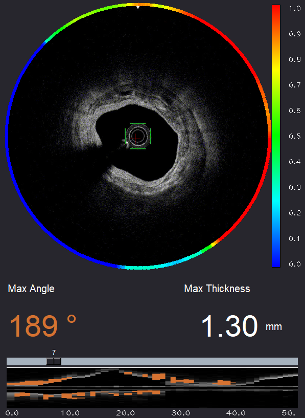

## Visualization of coronary artery calcium by optical frequency domain imaging



Code for paper Automatic extraction and visualization of coronary artery calcium by optical frequency domain imaging

(visualization part only)

## Installation
    $ git clone https://github.com/utanu/ofdi
    $ cd ofdi/
    $ pip install -r requirements.txt
    
## Usage

Tested on Python 3.8
```
$ python oct_ring.py
```
